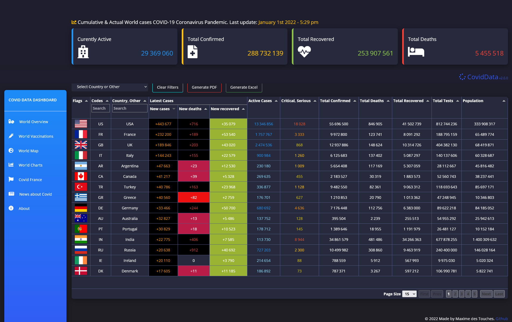
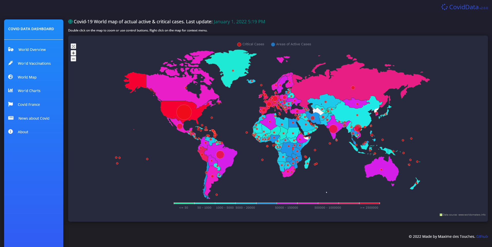
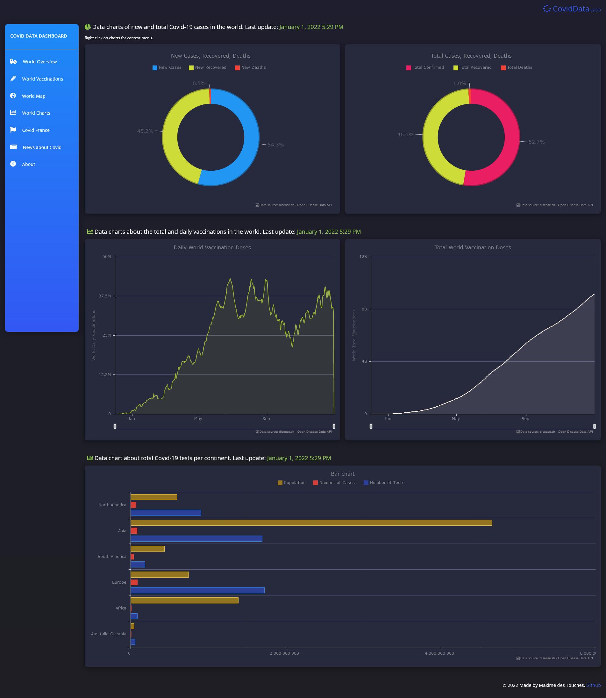
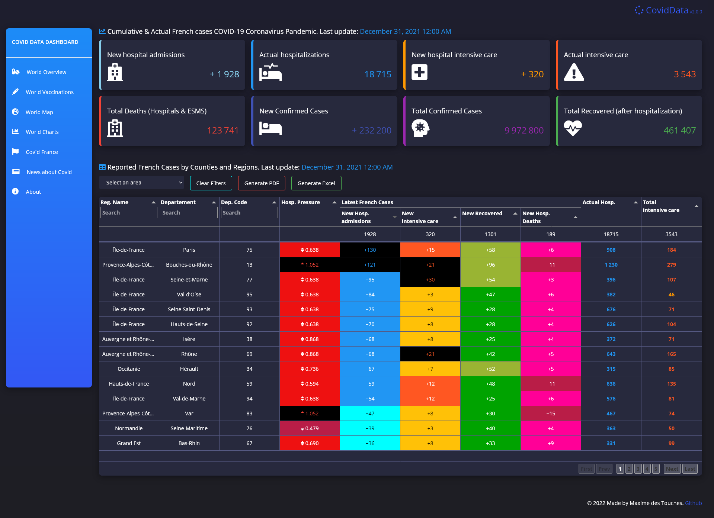

# Covid-19 Data dashboard
Lightweight, simple & optimised dashboard about the actual situation and the evolution of the Covid-19 in the world and especially in France.

## Web application available online : https://elreviae.github.io/coviddata/

----------------------

----------------------

# This dashboard shows :

- World Overview : Reported daily and global cases, deaths and recovered by country, territory or conveyance.

- World Vaccinations : Reported Vaccination Cases by Country, Territory, or Conveyance.

- World Map :  Covid-19 World map of actual active & critical cases

- World Charts : 
    - Data charts of new and total cases. 
    - Data charts about the total and daily vaccinations in the world.
    - Data chart about total Covid-19 test per continent.

- Covid France :
    - Cumulative & Actual French cases COVID-19 Coronavirus Pandemic.
    - Reported French Cases by Counties and Regions.

- News about Covid :
    - Reported of some recent news posts or articles about the Covid-19.

----------------------

# APIs
- Our World In Data - covid-19-data : https://github.com/owid/covid-19-data/tree/master/public/data
- disease.sh - Open Disease Data:  https://disease.sh/
- coronavirusAPI-France: https://github.com/florianzemma/CoronavirusAPI-France
- opendatasoft.com: https://public.opendatasoft.com
- newsapi.org: https://newsapi.org

----------------------

# Resources :

- JQuery: https://jquery.com/
- Tabulator: http://tabulator.info/
- AnyChart: https://www.anychart.com/
- W3.CSS Framework: https://www.w3schools.com/w3css/default.asp
- MomentJS: https://momentjs.com/
- JSPDF: https://github.com/MrRio/jsPDF
- JSPDF-AutoTable: https://github.com/simonbengtsson/jsPDF-AutoTable
- SheetJS: https://github.com/SheetJS/sheetjs
- Fontawesome.com: https://fontawesome.com/
